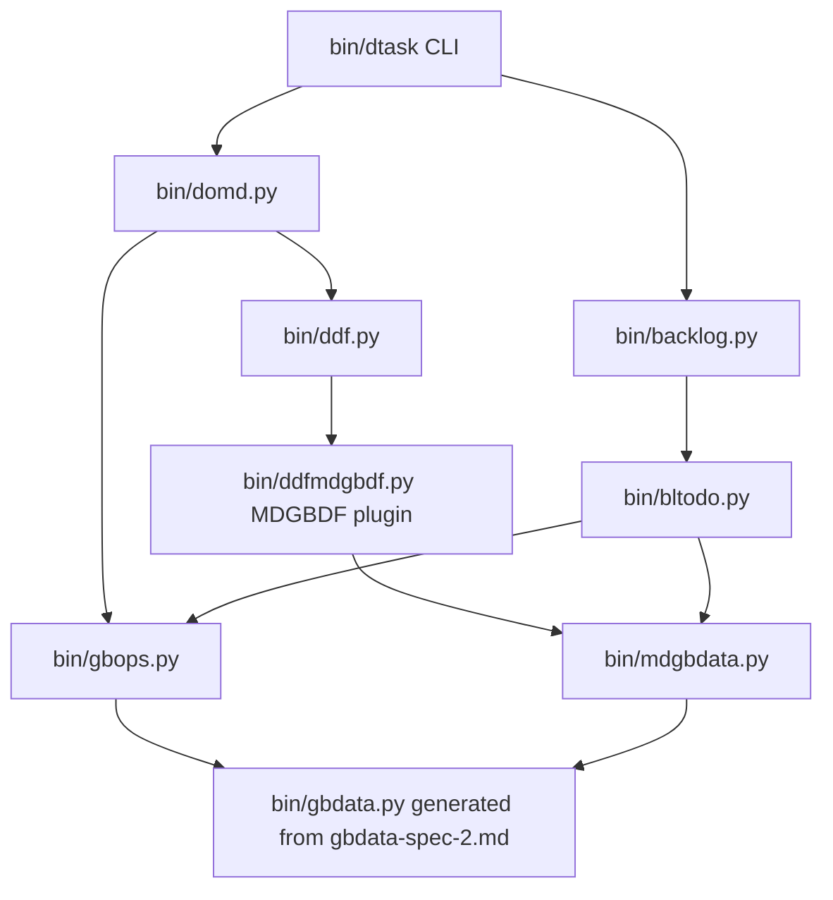

# dtask `commit --final` module structure spec

Status: Design (ready for implementation)

Covers the acceptance criteria in [docs/dev/work/do.md](../work/do.md):

- `dtask commit --final` must find incomplete work in the `# Current work` section of `do.md`,
  push whole stories that contain incomplete tasks back to the backlog, and remove them from `do.md`.
- `dtask commit` must record completed / abandoned / unfinished tasks in the `# Completed work`
  section as a **bare task list** (not enclosed in their stories), with `attributes.storyID` and
  `attributes.storyName` set so the story association is not lost.
- `backlog.py` must define a `PushStory` protocol; `bltodo.py` must implement it by lifting the story
  to the top of `TODO.md` and doing a task-wise upsert, saving a recovery copy before writing.

## Guiding principle

`bin/gbdata.py` is **generated in this repository** from [gbdata-spec-2.md](./gbdata-spec-2.md),
in conformance with the externally managed schema at
<https://github.com/psons/gb-data/blob/main/goalBlotter.schema.json>. It is *not* copied in from
the upstream repository; upstream owns the schema, this repo owns the Python module.

It therefore holds frozen dataclasses and nothing else. Every behavior this repo needs on those
types lives in a separate module, so that incorporating an infrequent upstream schema change is:

1. update [gbdata-spec-2.md](./gbdata-spec-2.md) to reflect the schema change,
2. regenerate `bin/gbdata.py` from that spec,

with no hand-merging of local behavior out of the regenerated file.

## Module map



Dependency rules:

- `gbdata.py` imports nothing local.
- `gbops.py` imports only `gbdata.py`. No I/O, no markdown, no git.
- `ddf.py` knows nothing about stories or tasks; it only knows the plugin registry contract.
- `dtask` imports only `domd` and `backlog`.

---

## 1. `bin/gbdata.py` — regenerated, never hand-extended

- The module is generated from [gbdata-spec-2.md](./gbdata-spec-2.md); that spec is the
  implementation source of truth, and the upstream `goalBlotter.schema.json` is the model source
  of truth that the spec tracks.
- No functions, helpers, or local imports are ever added here, because any such edit would be lost
  on the next regeneration.
- Add a provenance comment at the top of the module: the generating spec path, the upstream schema
  URL, and the upstream schema revision the spec was last reconciled against.
- Add `tests/test_gbdata_contract.py`, which asserts the fields this repo depends on still exist:
  - `Task`: `id`, `status`, `name`, `detail`, `attributes`
  - `Story`: `id`, `name`, `status`, `description`, `maxTasks`, `tasks`, `attributes`
  - `TaskStatus` / `StoryStatus` members used by `gbops.INCOMPLETE_TASK_STATUSES`

  A regeneration that breaks the local code then fails one small, obvious test instead of
  failing diffusely across five modules.

## 2. `bin/gbops.py` — NEW: pure operations over gbdata types

This is the isolation layer holding the behavior upstream does not provide.

```python
STORY_ID_ATTR = "storyID"
STORY_NAME_ATTR = "storyName"

INCOMPLETE_TASK_STATUSES = frozenset({
    TaskStatus.DO, TaskStatus.IN_PROGRESS, TaskStatus.SCHEDULED, TaskStatus.UNFINISHED,
})
DONE_TASK_STATUSES = frozenset({TaskStatus.COMPLETED, TaskStatus.ABANDONED})

def with_attributes(obj: Task | Story, **kv) -> Task | Story
def tag_task_with_story(task: Task, story: Story) -> Task
def tag_tasks_with_story(story: Story) -> list[Task]
def story_ref(task: Task) -> tuple[str | None, str | None]
def regroup_tasks_by_story(tasks: list[Task]) -> list[Story]

def upsert_tasks(existing: list[Task] | None, incoming: list[Task] | None) -> list[Task]
def upsert_story(existing: Story, incoming: Story) -> Story
def lift_story_to_top(stories: list[Story], story: Story) -> list[Story]
def find_story(stories: list[Story], story: Story) -> Story | None

def is_incomplete(task: Task) -> bool
def incomplete_tasks(story: Story) -> list[Task]
def finished_tasks(story: Story) -> list[Task]
def stories_with_incomplete_tasks(stories: list[Story]) -> list[Story]
```

Semantics:

- `upsert_tasks`: id-keyed merge. Tasks present in `incoming` replace the matching task in place
  (preserving `existing` order); tasks only in `incoming` are appended. **No task is ever deleted.**
- `upsert_story`: field-wise replace of scalar story fields from `incoming` when not `None`, plus
  `upsert_tasks` for the task list.
- `find_story`: match on `id`; fall back to case-insensitive `name` match when `id` is absent
  (stories popped before normalization existed may lack ids).
- `tag_tasks_with_story`: returns the story's tasks with `attributes[STORY_ID_ATTR]` and
  `attributes[STORY_NAME_ATTR]` merged in, never overwriting an existing non-empty value.
- `regroup_tasks_by_story`: inverse operation, grouping a bare task list back into `Story` objects
  keyed by `storyID`, using `storyName` for the story name. Tasks with no `storyID` are collected
  into a single anonymous story, consistent with `backlog.pop_story` behavior.

Upstream resilience: all construction is keyword-based and all mutation goes through
`dataclasses.replace`, so new optional fields added upstream are carried through merges without
editing `gbops.py`.

## 3. `bin/mdgbdata.py` — heading-level offset support

Today stories are recognized and rendered at H1. Inside `do.md` the stories live **within** the
`# Current work` H1 section, so they appear at H2, and could be deeper if the enclosing DDF section
is itself nested. `mdgbdata.py` must be able to parse and serialize a story list at an arbitrary
base heading level while keeping the round trip lossless.

### 3.1 Parsing

```python
def parse_stories_from_markdown(
    text: str,
    story_status_map: StoryStatusMap,
    task_status_map: TaskStatusMap,
    work_stories_only: bool = False,
    story_heading_level: int = 1,
) -> list[Story]: ...

def parse_stories_from_markdown_file(
    path, story_status_map, task_status_map,
    encoding: str = "utf-8",
    work_stories_only: bool = False,
    story_heading_level: int = 1,
) -> list[Story]: ...
```

Rules:

- `story_heading_level` is the heading level at which a story heading is recognized. Default `1`
  preserves all current behavior and all existing callers.
- Headings **at** `story_heading_level` start a new story (subject to the existing status-prefix
  and name parsing rules).
- Headings **deeper than** `story_heading_level` are content of the current story: they are appended
  to the story description or task detail exactly as today, with the text preserved verbatim
  (including their `#` characters).
- Headings **shallower than** `story_heading_level` are a caller error inside a plugin-parsed
  section, because the DDF plugin only ever hands the plugin the text of one section. The parser
  must raise `MdgbdataHeadingLevelError` with the offending line, rather than silently producing a
  file-scope story.
- The existing implicit file-scope story (content before the first story heading) is unchanged and
  is still produced when text precedes the first heading at `story_heading_level`.
- The parser records the observed level on each story so that a story parsed at H2 and re-serialized
  with the same `story_heading_level` round-trips byte-for-byte.

### 3.2 Serialization

```python
def stories_to_markdown_text(
    stories: list[Story],
    story_status_map: StoryStatusMap,
    task_status_map: TaskStatusMap,
    story_heading_level: int = 1,
) -> str: ...
```

Rules:

- `_render_markdown_story` emits `"#" * story_heading_level` instead of the hardcoded `"# "` for
  both the plain (`# {name}`) and status (`# {val} - Story: {name}`) heading forms.
- `story_heading_level` must be in `1..6`. Values outside that range raise
  `MdgbdataHeadingLevelError`. A plugin that would need to emit H7 must report the error rather than
  emit invalid markdown; this is the concrete resolution of the H-level issue recorded in
  [ddf-issues.md](./adr/ddf/ddf-issues.md).
- Task rendering, front-matter blocks, and the `file-input` suppressed-header rule are unchanged;
  tasks are not headings and are unaffected by the offset.
- JSON serialization is unaffected: heading level is a markdown presentation concern and is **not**
  stored on the `Story` model (which is schema-governed and must not gain repo-local fields).

### 3.3 Bare task list rendering

`# Completed work` holds tasks without stories. This is served by the existing implicit file-scope
story: `stories_to_markdown_text` already suppresses the header for a first story named
`file-input`, so `domd` renders completed tasks as a single `file-input` story whose tasks carry
`storyID` / `storyName` attributes. Those attributes are already round-tripped by the existing
task front-matter emit/parse path, so no additional serializer change is required.

### 3.4 CLI

`mdgbdata.py` gains a `--story-heading-level N` option that is threaded to the parse and serialize
calls, keeping the command module consistent with the library API per
[python-command-module-pattern.md](./python-command-module-pattern.md).

## 4. `bin/ddf.py` — generic plugin registry

`ddf.py` gains only the registry and template-rule machinery described in
[ddf-plugin-spec.md](./ddf-plugin-spec.md):

```python
def register_plugin(ddf_type: str, plugin: DDFPlugin) -> None
def resolve_ddf_type(heading: str, level: int, template: DDFTemplate | None) -> str | None
def parse_from_markdown(text: str, template: DDFTemplate | None = None) -> DDFDoc
def serialize_to_markdown(doc: DDFDoc) -> str
```

`DDFPlugin` is a `@runtime_checkable` `Protocol` with `parse_section`,
`serialize_section_markdown`, and `serialize_section_json`. `ddf.py` never imports `gbdata`,
`mdgbdata`, or `gbops`.

## 5. `bin/ddfmdgbdf.py` — NEW: the MDGBDF plugin

Registered for `ddfType: MDGBDF`.

```python
@dataclass
class MDGBDFSection(DDFSection):
    stories: list[Story] = field(default_factory=list)
    ddfType: str = "MDGBDF"
    heading_level: int = 1

def parse_section(heading: str, level: int, text: str) -> MDGBDFSection
def serialize_section_markdown(section: MDGBDFSection) -> str
def serialize_section_json(section: MDGBDFSection) -> dict
```

- `parse_section` calls `mdgbdata.parse_stories_from_markdown(text, ..., story_heading_level=level + 1)`.
  This is the connection point for the enhancement in section 3: a `# Current work` H1 section
  yields stories parsed at H2.
- `serialize_section_markdown` emits the section heading itself, then
  `mdgbdata.stories_to_markdown_text(section.stories, ..., story_heading_level=section.heading_level + 1)`.
- `serialize_section_json` returns a JSON object (never a list) with `heading`, `ddfType`,
  `attributes`, and `stories` (from `mdgbdata.stories_to_json_text`), per the plugin spec.
- The runtime `ddfType` is kept as a field distinct from `attributes`, so a template override does
  not destroy a conflicting `ddfType` attribute in the source document.

## 6. `bin/backlog.py` — add the `PushStory` protocol

```python
@runtime_checkable
class PushStory(Protocol):
    def push_story(self, story: Story) -> Story: ...
```

- New subcommand `pushstory`, which reads MDGBDF or JSON from a file argument or stdin.
- A programmatic entry point `push_story(story: Story, provider: str | None = None) -> Story` so
  `dtask` passes a `Story` object directly instead of round-tripping through text.
- `run_backlog_command` gains the `pushstory` dispatch and returns the merged story in the existing
  `BacklogCommandResult` shape.
- `backlog.py` contains **no** merge logic. It performs provider resolution, the `isinstance`
  protocol check (raising a user-facing error when the provider does not implement `PushStory`),
  and dispatch.

## 7. `bin/bltodo.py` — implement `PushStory`

```python
def push_story(story: Story, todo_file: str | Path | None = None) -> Story:
    path = resolve_todo_file_path(todo_file)
    normalize_backlog(path)                     # guarantees ids on existing stories
    stories = _read_stories_from_backlog(path)  # re-read to pick up normalized ids
    save_recovery(path)                         # required before any write
    match = gbops.find_story(stories, story)
    merged = gbops.upsert_story(match, story) if match else story
    remaining = [s for s in stories if s is not match]
    _write_stories_to_backlog(path, gbops.lift_story_to_top(remaining, merged))
    return merged
```

- The recovery copy is mandatory and must succeed before the write, matching the existing
  `normalize_backlog` and `pop_story` contracts in [backlog-spec.md](./backlog-spec.md).
- Plugin-specific concerns (path resolution, recovery, MDGBDF write-back, ordering) stay here.
  The *meaning* of "upsert" stays in `gbops.py` so future `bljira.py` / `blgb.py` plugins reuse it.
- `TODO.md` is written at `story_heading_level=1` (the default), unchanged from today.

## 8. `bin/domd.py` — NEW: the `do.md` domain layer

A command module per [python-command-module-pattern.md](./python-command-module-pattern.md):
typed result object, CLI plus an importable API. This is the half that `dtask` drives with a DDF
object.

```python
DO_MD_TEMPLATE = {"rules": [
    {"pattern": r"^# Current work\s*$",   "ddfType": "MDGBDF"},
    {"pattern": r"^# Completed work\s*$", "ddfType": "MDGBDF"},
]}

CURRENT_WORK = "Current work"
COMPLETED_WORK = "Completed work"

@dataclass
class DoMdCommandResult:
    command: str
    do_md_path: Path
    pushed_stories: list[Story]
    completed_tasks: list[Task]
    output_text: str

class DoDoc:
    doc: DDFDoc
    def current_work_stories(self) -> list[Story]
    def set_current_work_stories(self, stories: list[Story]) -> None
    def completed_work_tasks(self) -> list[Task]
    def append_completed_tasks(self, tasks: list[Task]) -> None
    def drop_stories(self, story_ids: Iterable[str]) -> None

def load(path: str | Path) -> DoDoc
def save(doc: DoDoc, path: str | Path) -> None
def harvest_completed(doc: DoDoc) -> list[Task]
def stories_to_push_back(doc: DoDoc) -> list[Story]
def finalize(path, *, provider: str | None = None) -> DoMdCommandResult
```

- `load` parses `do.md` with `ddf.parse_from_markdown(text, template=DO_MD_TEMPLATE)`; the matched
  sections come back as `MDGBDFSection` objects carrying `stories`.
- `harvest_completed` removes tasks whose status is in `gbops.DONE_TASK_STATUSES` from the current
  work stories, tags them via `gbops.tag_tasks_with_story`, and appends them to the completed work
  section as a bare list.
- `stories_to_push_back` is `gbops.stories_with_incomplete_tasks(doc.current_work_stories())`.
- `finalize` composes the whole `--final` sequence and is what `dtask` calls; the CLI subcommand
  `domd finalize` exercises the same function for testing and manual recovery.

## 9. `bin/dtask` — orchestration only

```python
# inside cmd_commit, when args.final
result = domd.finalize(do_md_path)     # harvest + push + drop + save
# existing flow continues: stage, commit, remove do.md, second commit
```

`dtask` never imports `mdgbdata`, `bltodo`, `gbops`, or `ddf` directly. Push failures are fatal:
if any `push_story` call fails, `do.md` must not be modified or deleted, and the story markdown is
printed to stderr for manual recovery, matching the existing `dtask pop` failure contract.

## Impact of upstream `gb-data` schema changes

The update path is always: schema change upstream → update `gbdata-spec-2.md` → regenerate
`bin/gbdata.py` → run the contract test.

| Change in `goalBlotter.schema.json` | Blast radius |
| --- | --- |
| New optional field on `Task` / `Story` | none; `replace`-based merges pass it through and the contract test still passes |
| Field renamed or removed | `tests/test_gbdata_contract.py` fails first; the fix is confined to `gbops.py` and `mdgbdata.py` |
| New status value | status-map JSON files plus the `gbops` status sets |
| Behavior we want (upsert, story tagging, incomplete detection) | added to `gbops.py`, never to `gbdata.py`, so regeneration is always a clean overwrite |

## Testing

Per the command module pattern, unit tests plus pytest-bdd features:

- `tests/test_gbdata_contract.py` — upstream field contract.
- `tests/test_gbops.py` — upsert, lift, tagging, regrouping, incomplete detection.
- `tests/test_mdgbdata_heading_level.py` — parse and serialize at levels 1..6, round-trip at H2,
  error on level 7 and on a heading shallower than `story_heading_level`.
- `tests/test_bltodo_push_story.py` — new story, existing story upsert, lift to top, recovery file
  written before the update, no task deleted.
- `tests/test_domd.py` — harvest, push-back selection, bare completed task list with
  `storyID` / `storyName`.
- `tests/features/dtask_final/` — BDD coverage of `dtask commit --final` with incomplete work,
  asserting `TODO.md` content and that `do.md` is removed only after a successful push.
  Tests must not read or write the repository's own `docs/dev/work/TODO.md`.
